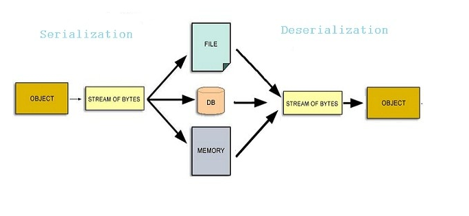

# VALIDATING XML USING DTD

Computer systems vary in terms of hardware architecture, operating system, memory management mechanisms, and addressing architecture. Data inside computers is represented as binary values (0s and 1s).

Depending on the architecture, the representations will vary. Similarly, the storage and communication mechanisms also differ between each system.

With each system having different architectures, communication between two different architectures will require a common medium to transport data. This leads us to the concept of Data serialization.

Data is stored as data structures similar to an array, tree, or heaps. For communication, we must transform the complex structures into byte sequences. This series of bytes gets transported to the destination machine, to establish communication. The reverse process of Serialization is Deserialization.

Deserialization takes a series of bytes and converts it to an in-memory data structure. For example, in JavaScript, the `JSON` data that is passed to the web browser client as a `string` using `JSON.stringify()`, is Serialization. And the parsing the `string` back to `JSON` using `JSON.parse()`, is deserialization.

## Overview of XML

The invention of the World Wide Web in 1989 by [Sir Timothy Berners Lee](https://en.wikipedia.org/wiki/Tim_Berners-Lee) led to the rise of the Internet and [HTML](https://en.wikipedia.org/wiki/HTML). HTML is a markup language used to interpret text, images, and other types of data as webpages in web browsers.

The [Internet Engineering Task Force](https://en.wikipedia.org/wiki/Internet_Engineering_Task_Force) formally defined the rules of HTML. It has been maintained and improved continuously by the [World Wide Web Consortium](https://en.wikipedia.org/wiki/World_Wide_Web_Consortium). Over the last 30 years, they have launched various versions of HTML, the latest being HTML5.

The root of web development is HTML. However, when converting the data to HTML, there is a high chance of losing information. Information needs to be exchanged without loss, this need led to the rise of XML, which is a markup language.

A markup language is a way of styling a document to be syntactically distinguishable from the text where the document is processed only to render the text, while not displaying the markup language.

[XML (eXtensible Markup Language)](https://en.wikipedia.org/wiki/XML) is a simple and flexible markup language that can enable data serialization by exchanging information between two data serialization formats, to describe the contents better. Initially, XML was used to describe the contents, but it’s also being used to transfer data. It improves on the existing HTML approach and helps in communication among other data serialization types.

[Document Object Model (DOM)](https://en.wikipedia.org/wiki/Document_Object_Model) is used to create a tree-like structure of a well-formed XML document. DOM facilitates the adding of objects to the tree structure to access and manipulate XML documents. We can learn more about DOM in this Section article [‘Understanding Document Object Model (DOM)’](https://www.section.io/engineering-education/document-object-model/).

Creating XML documents was much easier, but sometimes it could leads to frequent errors like not matching the required syntax. Since XML codes are neither compiled nor interpreted, the only option left was to parse. Making validation of XML codes necessary.

## What is Document Type Definition

[Document Type Definition (DTD)](https://en.wikipedia.org/wiki/Document_type_definition) is a markup language rulebook that defines what markup elements can describe a document. The creation of user-defined tags in XML was much simpler, so the user had to specify the required tag in DTD, for validation. It defines and checks the structure of the elements and attributes used for each element in the XML document.

## Need for XML Validation

Browsers like Internet Explorer contain built-in XML parsers, that check if the document is  **well-formed** , and if it  **validates the parser** . A document is well-formed if it follows the basic syntactic rules of XML.

A document is valid if it checks for the rules mentioned by DTD for the particular XML. For validation, there are various online automated validators like [this](https://codebeautify.org/xmlvalidator). Alternatively, there are extensions in text editors like VSCode with built-in validation.

**Source:** [https://www.section.io/engineering-education/validating-xml-using-dtd/]()

# TASK 1:

Write an internal Document Type Definition to validate XML for CUSTOMER DETAILS.

# TASK 2:

Write an external Document Type Definition to validate for CUSTOMER DETAILS.
